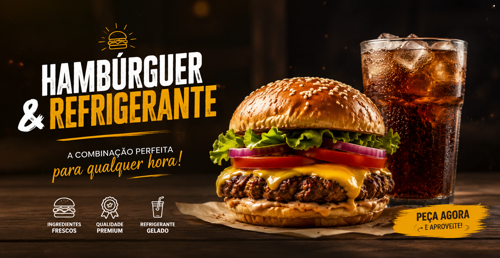

# 🍔 Puro Smash — E-commerce & Delivery

<p align="center">
  
</p>

<p align="center">
  
  
  
  
</p>

<p align="center">
  Um e-commerce moderno de hambúrgueres premium e bebidas, desenvolvido com React.js e Vite.
</p>

---

## 📖 Sobre o Projeto

O **Puro Smash** é um projeto de e-commerce e delivery desenvolvido para simular uma experiência real de compra online.
A aplicação permite que o usuário navegue pelo cardápio, adicione produtos à sacola em tempo real e finalize o pedido diretamente pelo WhatsApp com uma mensagem formatada automaticamente.

O projeto foi desenvolvido com foco em:

* Experiência do usuário (UX)
* Responsividade
* Componentização
* Gerenciamento de estados
* Integração prática com WhatsApp

---

# ✨ Funcionalidades

* 🍔 Cardápio completo de hambúrgueres e bebidas
* 🛒 Sacola dinâmica com atualização automática
* ➕ Controle de quantidade dos produtos
* ❌ Remoção de itens do carrinho
* ⚡ Toast Notification ao adicionar produtos
* 📱 Finalização do pedido via WhatsApp
* 🔄 Navegação SPA (Single Page Application)
* 📱 Layout totalmente responsivo
* 🎨 Interface moderna e intuitiva

---

# 🛠️ Tecnologias Utilizadas

* **React.js**
* **Vite**
* **JavaScript (ES6+)**
* **CSS3**
* **Flexbox & CSS Grid**
* **Google Fonts**

---

# 📂 Estrutura do Projeto

```bash
src/
├── Imagens/
│   ├── Banner-do-site.png
│   └── Produtos e ícones
│
├── About.css
├── About.jsx
├── App.css
├── App.jsx
├── bag.css
├── bag.jsx
├── Contato.css
├── Contato.jsx
├── index.css
├── lanches.css
├── lanches.jsx
└── main.jsx
```

---

# ⚙️ Como Executar o Projeto

## 1️⃣ Clone o repositório

```bash
git clone https://github.com/davidmanoel07/Puro-Smash.git
```

---

## 2️⃣ Acesse a pasta do projeto

```bash
cd Puro-Smash
```

---

## 3️⃣ Instale as dependências

```bash
npm install
```

---

## 4️⃣ Execute o projeto

```bash
npm run dev
```

---

## 5️⃣ Abra no navegador

Acesse o endereço exibido no terminal:

```bash
http://localhost:5173
```

---

# 🎯 Conceitos Praticados

Este projeto foi desenvolvido para consolidar conceitos importantes do ecossistema Front-End:

### 🔹 Componentização

Separação da interface em componentes reutilizáveis.

### 🔹 Gerenciamento de Estado

Compartilhamento e atualização dinâmica de estados entre componentes.

### 🔹 Manipulação Imutável de Arrays

Atualização de produtos do carrinho sem mutações diretas.

### 🔹 Responsividade

Adaptação completa para desktops, tablets e smartphones.

### 🔹 Integração com APIs

Envio automatizado do pedido via WhatsApp.

---

# 📸 Preview do Projeto

<p align="center">
  
</p>

---

# 👨‍💻 Autor

Desenvolvido por **David Oliveira**.

### 📫 Contato

* LinkedIn: `david-oliveira0101`
* Instagram: `@davidoliver.dev`

---

# 📄 Licença

Este projeto está sob a licença **MIT**.

Consulte o arquivo `LICENSE` para mais informações.

